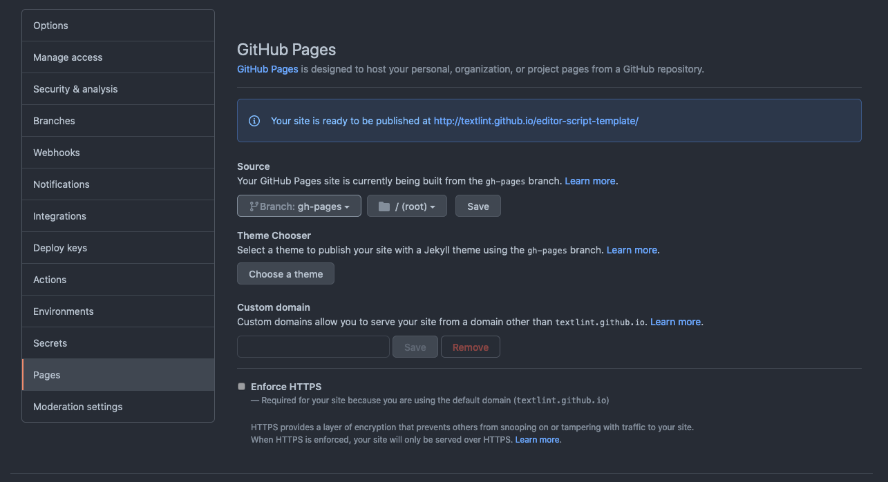

# @textlint/editor-script-template

This template for [@textlint/editor](https://github.com/textlint/editor) worker scripts.

## Setup

1. Use this template → fork repository
   - Repository name: your favorite name
   - ✔ Include all branches
2. Enable GitHub Pages on your repository's settings
   - Source: Branch `gh-pages`



## Add new rule

    npm install textlint-rule-<you-want-to-add-rule>
    # edit .textlintrc.json and add it
    git add .
    git commit -m "feat: add new rule"

After a commit, GitHub Actions publish your website to GitHub pages.

## Test rule

@textlint/editor script require browser supported textlint rule. So, Some textlint rule does not work on
@textlint/editor.

You can test the rule on local.

    npm run website -- --metadataName="your script name" --metadataNamespace="https://github.com/your/repo" --metadataHomepage="https://github.com/your/repo"
    npx http-serve dist/

or add some metadata into `package.json`:

```json5
{
  "private": true,
  "name": "@textlint/editor-script-template",
  // <= edit your rule name
  "version": "1.0.0",
  "homepage": "https://github.com/your/repo",
  // <= add your repository url
  "description": "@textlint/editor script template",
  "scripts": {
    "website": "textlint-website-generator --outputDir dist"
  },
  "devDependencies": {
    "@textlint/website-generator": "^0.10.0"
  },
  "dependencies": {
    "textlint": "^11.9.0",
    "textlint-filter-rule-comments": "^1.2.2",
    "textlint-rule-no-todo": "^2.0.1"
  }
}
```

After the setup, you can build and serve:

    npm run website
    npx http-serve dist/
